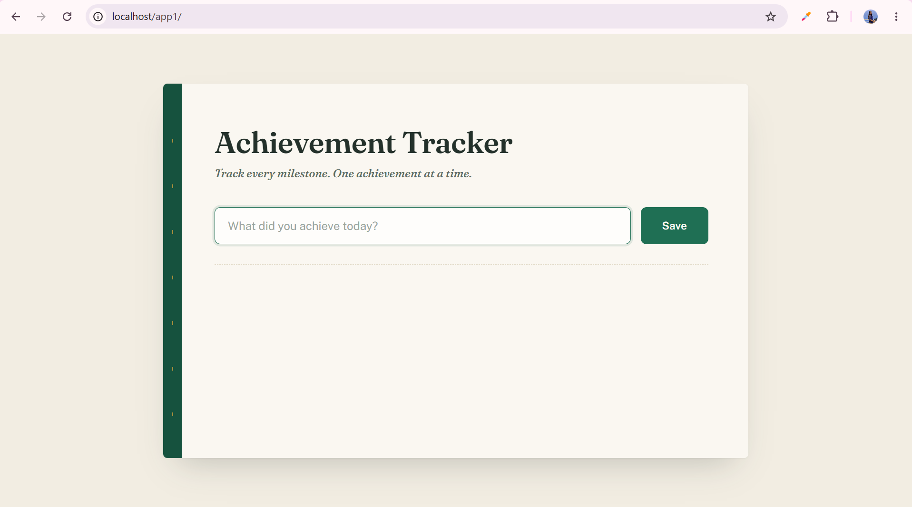
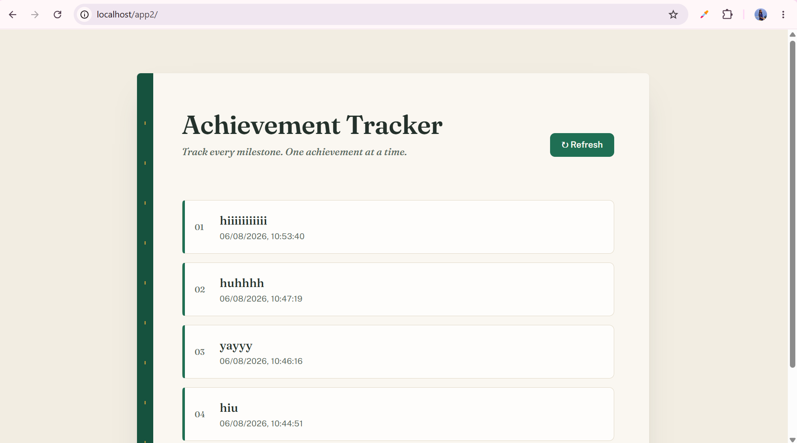
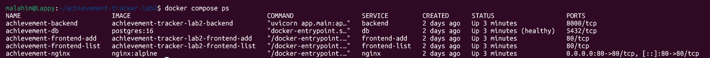
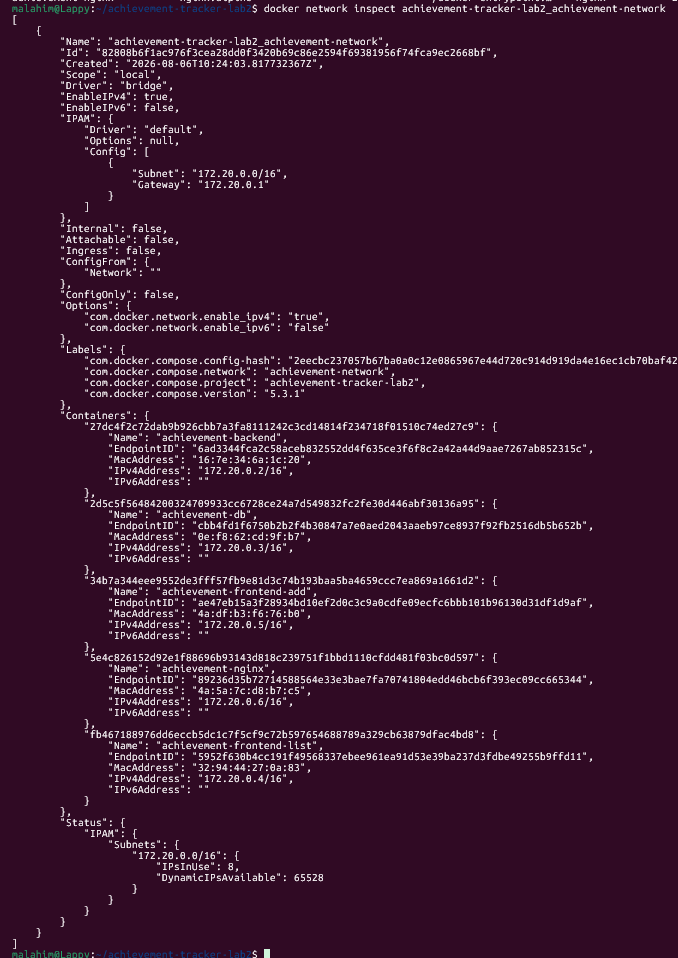
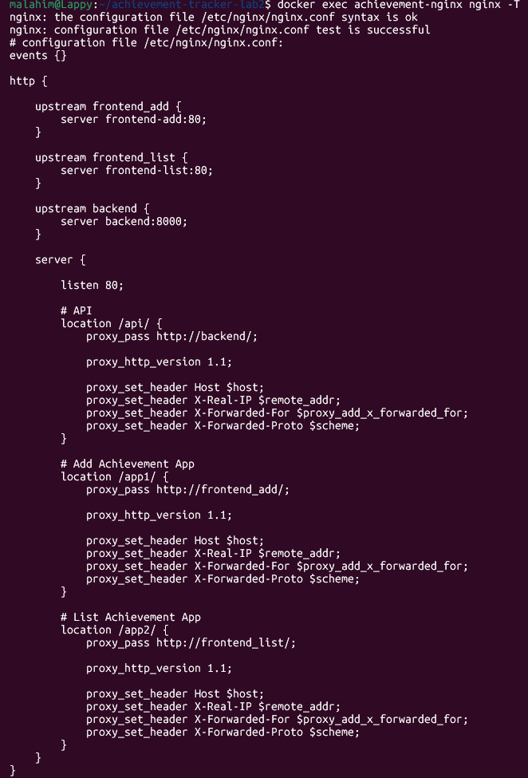
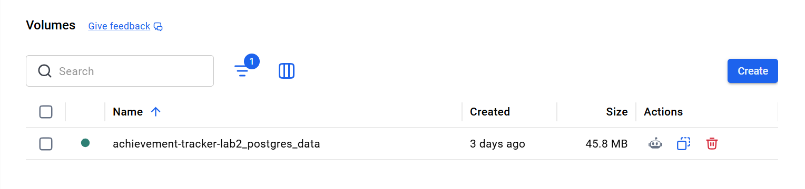

# 🏆 Achievement Tracker — Docker Compose

A containerized **Achievement Tracker** application built to demonstrate multi-container application architecture, Docker networking, persistent storage, reverse proxying, service discovery, and frontend/backend communication using **Docker Compose**.

The project consists of two separate React frontend applications, a FastAPI backend, PostgreSQL database, and a centralized Nginx reverse proxy.

> **Project focus:** Docker, Docker Compose, containerization, networking, volumes, service discovery, reverse proxying, and multi-container application architecture.

---

## 📌 Table of Contents

* [Overview](#-overview)
* [Architecture](#-architecture)
* [Application Components](#-application-components)
* [Technology Stack](#-technology-stack)
* [Project Structure](#-project-structure)
* [How the Application Works](#-how-the-application-works)
* [Docker Compose Services](#-docker-compose-services)
* [Networking](#-networking)
* [Nginx Reverse Proxy](#-nginx-reverse-proxy)
* [Frontend Applications](#-frontend-applications)
* [Backend API](#-backend-api)
* [PostgreSQL Database](#-postgresql-database)
* [Persistent Storage](#-persistent-storage)
* [Container Communication](#-container-communication)
* [Routing](#-routing)
* [Getting Started](#-getting-started)
* [Screenshots](#-screenshots)
* [Architecture Diagram](#-architecture-diagram)
* [Learning Outcomes](#-learning-outcomes)
* [Future Improvements](#-future-improvements)

---

# 🚀 Overview

**Achievement Tracker** is a small full-stack web application designed as a practical Docker and Docker Compose laboratory.

The application allows users to:

* Add achievements
* Store achievements in PostgreSQL
* View stored achievements
* Refresh the achievement list
* Access multiple frontend applications through different URL paths
* Communicate with the backend through Nginx
* Persist database data using a Docker named volume

The application is intentionally split into multiple containers to demonstrate how a real multi-service application can be containerized and connected.

---

# 🏗 Architecture

The application consists of **five containers**:

1. **Nginx Reverse Proxy**
2. **Frontend — Add Achievement**
3. **Frontend — List Achievements**
4. **FastAPI Backend**
5. **PostgreSQL Database**

All containers communicate through a dedicated Docker bridge network.

```text
                         Browser
                            │
                            │ HTTP :80
                            ▼
                 ┌──────────────────────┐
                 │   Nginx Reverse      │
                 │       Proxy          │
                 │ achievement-nginx    │
                 └──────────┬───────────┘
                            │
              ┌─────────────┼─────────────┐
              │             │             │
              ▼             ▼             ▼
         /app1/          /app2/          /api/
              │             │             │
              ▼             ▼             ▼
     ┌─────────────┐ ┌─────────────┐ ┌──────────────┐
     │ Frontend    │ │ Frontend    │ │   FastAPI    │
     │ Add         │ │ List        │ │   Backend    │
     │ React+Nginx │ │ React+Nginx │ │   :8000      │
     └─────────────┘ └─────────────┘ └──────┬───────┘
                                            │
                                            │ PostgreSQL
                                            ▼
                                   ┌──────────────────┐
                                   │   PostgreSQL 16  │
                                   │      :5432       │
                                   └────────┬─────────┘
                                            │
                                            ▼
                                   ┌──────────────────┐
                                   │ postgres_data    │
                                   │ Docker Volume    │
                                   └──────────────────┘
```

A more detailed interactive architecture diagram is available here:

👉 [`docs/architecture.html`](./docs/architecture.html)

The repository's architecture documentation is maintained separately so the system design can be inspected without needing to read the entire Compose configuration.

---

# 🧩 Application Components

## 1. Nginx Reverse Proxy

Container:

```text
achievement-nginx
```

Responsibilities:

* Acts as the single public entry point
* Listens on host port `80`
* Routes traffic based on URL paths
* Forwards API requests to FastAPI
* Forwards `/app1/` requests to the Add frontend
* Forwards `/app2/` requests to the List frontend

The Nginx container is the only application container exposed directly to the host.

---

## 2. Add Achievement Frontend

Container:

```text
achievement-frontend-add
```

Technology:

* React
* Vite
* Axios
* Nginx

Purpose:

Provides the interface for adding new achievements.

Accessible through:

```text
http://localhost/app1/
```

---

## 3. List Achievement Frontend

Container:

```text
achievement-frontend-list
```

Technology:

* React
* Vite
* Axios
* Nginx

Purpose:

Displays achievements stored in PostgreSQL.

Accessible through:

```text
http://localhost/app2/
```

The list page retrieves data from the backend and supports refreshing the displayed achievements.

---

## 4. FastAPI Backend

Container:

```text
achievement-backend
```

Technology:

* Python
* FastAPI
* Uvicorn
* SQLAlchemy
* PostgreSQL driver

The backend provides the REST API used by both frontend applications.

The backend listens internally on:

```text
8000
```

It is intentionally **not published directly to the host**.

Instead, Nginx communicates with it through Docker's internal network.

---

## 5. PostgreSQL Database

Container:

```text
achievement-db
```

Image:

```text
postgres:16
```

PostgreSQL stores the achievement records.

The database is also kept internal to the Docker network rather than being exposed to the host.

---

# 🛠 Technology Stack

| Layer               | Technology            |
| ------------------- | --------------------- |
| Frontend            | React                 |
| Frontend Build Tool | Vite                  |
| HTTP Client         | Axios                 |
| Frontend Web Server | Nginx                 |
| Backend             | FastAPI               |
| Backend Server      | Uvicorn               |
| ORM                 | SQLAlchemy            |
| Database            | PostgreSQL 16         |
| Containerization    | Docker                |
| Orchestration       | Docker Compose        |
| Reverse Proxy       | Nginx                 |
| Network             | Docker Bridge Network |
| Storage             | Docker Named Volume   |

---

# 📁 Project Structure

```text
achievement-tracker-docker-compose/
│
├── backend/
│   ├── Dockerfile
│   ├── requirements.txt
│   └── app/
│       └── ...
│
├── frontend/
│   └── ...
│
├── frontend-add/
│   ├── Dockerfile
│   ├── nginx.conf
│   ├── package.json
│   ├── package-lock.json
│   ├── index.html
│   └── src/
│       ├── App.jsx
│       ├── App.css
│       └── main.jsx
│
├── frontend-list/
│   ├── Dockerfile
│   ├── nginx.conf
│   ├── package.json
│   ├── package-lock.json
│   ├── index.html
│   └── src/
│       ├── App.jsx
│       ├── App.css
│       └── main.jsx
│
├── nginx/
│   └── nginx.conf
│
├── docs/
│   ├── architecture.html
│   └── screenshots/
│       ├── add-screen.png
│       ├── containers.png
│       ├── list-screen.png
│       ├── network.png
│       ├── nginx.png
│       └── volume.png
│
├── docker-compose.yml
├── .gitignore
└── README.md
```

---

# 🔄 How the Application Works

The overall request flow is:

```text
User
  │
  ▼
Browser
  │
  │ http://localhost/
  ▼
Nginx Reverse Proxy
  │
  ├── /app1/ ──────────► Add Frontend
  │
  ├── /app2/ ──────────► List Frontend
  │
  └── /api/ ───────────► FastAPI Backend
                              │
                              ▼
                         PostgreSQL
                              │
                              ▼
                       postgres_data
```

### Adding an achievement

```text
User
  ↓
Add Frontend
  ↓
Nginx /api/
  ↓
FastAPI
  ↓
SQLAlchemy
  ↓
PostgreSQL
  ↓
Achievement stored
```

### Viewing achievements

```text
User
  ↓
List Frontend
  ↓
Nginx /api/
  ↓
FastAPI
  ↓
PostgreSQL
  ↓
Achievements returned
  ↓
React renders achievement cards
```

---

# 🐳 Docker Compose Services

The project uses Docker Compose to define and run all services together.

The Compose file defines:

```text
nginx
frontend-add
frontend-list
backend
db
```

The Compose configuration also defines:

```text
achievement-network
postgres_data
```

The current Compose configuration uses a dedicated bridge network and a named PostgreSQL volume.

---

## Nginx Service

```yaml
nginx:
  image: nginx:alpine
  container_name: achievement-nginx
  ports:
    - "80:80"
```

Nginx is the only container whose port is published to the host.

```text
Host :80
   ↓
Container :80
```

---

## Frontend Services

Both frontend applications are built from their own Dockerfiles.

```text
frontend-add
frontend-list
```

They use a multi-stage Docker build:

```text
Node.js build stage
       ↓
npm install
       ↓
npm run build
       ↓
React production files
       ↓
Nginx Alpine production stage
```

This keeps the final frontend containers focused on serving production static files rather than carrying the entire Node.js build environment.

---

## Backend Service

The backend is built from:

```text
./backend
```

It exposes port `8000` internally:

```yaml
expose:
  - "8000"
```

It is not mapped like:

```yaml
ports:
  - "8000:8000"
```

This is intentional.

The backend is meant to be reached through Nginx and Docker's internal networking.

---

## Database Service

PostgreSQL uses:

```text
postgres:16
```

The database exposes port `5432` internally and stores its data in the named volume:

```text
postgres_data
```

A PostgreSQL healthcheck is also configured using:

```text
pg_isready
```

The backend depends on the database becoming healthy before starting.

---

# 🌐 Networking

Docker Compose creates a dedicated bridge network:

```text
achievement-network
```

All application containers join this network.

Conceptually:

```text
achievement-network
│
├── achievement-nginx
├── achievement-frontend-add
├── achievement-frontend-list
├── achievement-backend
└── achievement-db
```

Containers can communicate with one another using Docker Compose service names instead of hard-coded IP addresses.

For example:

```text
backend:8000
```

and:

```text
db:5432
```

This is preferable to using container IP addresses because Docker service discovery automatically resolves service names within the Compose network.

---

# 🔀 Nginx Reverse Proxy

Nginx performs path-based routing.

## API

```text
/api/
```

is forwarded to:

```text
backend:8000
```

Example:

```text
http://localhost/api/achievements
```

Internally:

```text
Browser
   ↓
Host :80
   ↓
achievement-nginx
   ↓
backend:8000
```

---

## Add Application

```text
/app1/
```

routes to:

```text
frontend-add:80
```

Example:

```text
http://localhost/app1/
```

---

## List Application

```text
/app2/
```

routes to:

```text
frontend-list:80
```

Example:

```text
http://localhost/app2/
```

---

# 🖥 Frontend Applications

The project intentionally uses two separate frontend applications.

### Add application

```text
/app1/
```

Used for entering new achievements.

### List application

```text
/app2/
```

Used for displaying saved achievements.

This demonstrates how multiple independent frontend services can coexist behind one reverse proxy.

---

# 🔌 Backend API

The backend exposes API endpoints used by the frontend applications.

One of the main endpoints is:

```text
GET /achievements
```

which retrieves stored achievements.

The frontend reaches the API through Nginx:

```text
/app2/api/achievements
```

and Nginx routes the request toward the backend.

The backend itself remains internal to the Docker network.

---

# 🗄 PostgreSQL Database

PostgreSQL stores achievement information.

The application connects to PostgreSQL using the Docker Compose service name:

```text
db
```

rather than:

```text
localhost
```

This distinction is important.

Inside a container:

```text
localhost
```

means **that same container**.

Therefore:

```text
backend → localhost:5432
```

would attempt to find PostgreSQL inside the backend container.

Instead:

```text
backend → db:5432
```

means:

```text
backend container
      ↓
Docker DNS
      ↓
achievement-db
      ↓
PostgreSQL :5432
```

---

# 💾 Persistent Storage

The PostgreSQL container uses a Docker named volume:

```text
postgres_data
```

mounted at:

```text
/var/lib/postgresql/data
```

The architecture is:

```text
PostgreSQL Container
        │
        ▼
/var/lib/postgresql/data
        │
        ▼
postgres_data
        │
        ▼
Docker-managed persistent storage
```

This means database data is separated from the lifecycle of the PostgreSQL container.

For example, removing and recreating the database container does not automatically remove the named volume.

---

# 🔗 Container Communication

The application demonstrates two different types of communication.

### External communication

The browser communicates with:

```text
localhost:80
```

through the Nginx container.

### Internal communication

Containers communicate through:

```text
achievement-network
```

using service names.

Examples:

```text
nginx → backend:8000
nginx → frontend-add:80
nginx → frontend-list:80
backend → db:5432
```

This provides service discovery without requiring manually assigned container IP addresses.

---

# 🚦 Routing Table

| Request                     | Destination        |
| --------------------------- | ------------------ |
| `/app1/`                    | `frontend-add:80`  |
| `/app2/`                    | `frontend-list:80` |
| `/api/`                     | `backend:8000`     |
| Backend database connection | `db:5432`          |

---

# ⚙️ Getting Started

## Prerequisites

Install:

* Docker Desktop
* Docker Compose
* Git

Verify Docker:

```bash
docker --version
```

Verify Docker Compose:

```bash
docker compose version
```

---

## 1. Clone the repository

```bash
git clone https://github.com/MalahimCh/achievement-tracker-docker-compose.git
```

```bash
cd achievement-tracker-docker-compose
```

---

## 2. Configure environment variables

The Compose configuration expects environment variables for the backend and database.

Create the required environment file:

```bash
touch .env
```

Populate it with the required PostgreSQL configuration used by the application.

> Do not commit real passwords, API keys, or other secrets to GitHub.

---

## 3. Build and start the application

Run:

```bash
docker compose up -d --build
```

Docker Compose will:

1. Create the Docker network
2. Build the backend image
3. Build the Add frontend image
4. Build the List frontend image
5. Pull PostgreSQL
6. Pull Nginx
7. Create the PostgreSQL volume
8. Start PostgreSQL
9. Wait for the database healthcheck
10. Start the backend
11. Start both frontend containers
12. Start Nginx

---

# 🔍 Verify Containers

Run:

```bash
docker compose ps
```

Expected services:

```text
achievement-nginx
achievement-frontend-add
achievement-frontend-list
achievement-backend
achievement-db
```

---

# 🌐 Access the Applications

### Add Achievement

```text
http://localhost/app1/
```

### List Achievements

```text
http://localhost/app2/
```

### API

```text
http://localhost/api/achievements
```

---

# 📸 Screenshots

The repository includes screenshots documenting the running application and Docker infrastructure.

## Add Achievement Screen

Shows the frontend used to create achievements.



---

## Achievement List Screen

Shows the frontend used to retrieve and display saved achievements.



---

## Running Containers

Demonstrates the five-container application stack running through Docker Compose.



---

## Docker Network

Shows the dedicated Docker network used for communication between the services.



---

## Nginx Configuration

Shows the reverse proxy configuration responsible for routing traffic between the applications and backend.



---

## PostgreSQL Volume

Shows the persistent Docker volume used by PostgreSQL.



---

# 🗺 Architecture Diagram

A complete interactive architecture diagram is available at:

[`docs/architecture.html`](./docs/architecture.html)

The diagram illustrates:

* Browser access
* Nginx reverse proxy
* `/app1/` routing
* `/app2/` routing
* `/api/` routing
* Frontend containers
* FastAPI backend
* PostgreSQL
* Docker bridge networking
* Persistent database storage

---

# 📚 Learning Outcomes

This project provides hands-on experience with:

* Docker fundamentals
* Dockerfiles
* Docker images
* Containers
* Docker Compose
* Multi-container architectures
* Bridge networks
* Docker DNS
* Container-to-container communication
* Port publishing
* Internal container ports
* Named volumes
* PostgreSQL containerization
* Healthchecks
* Service dependencies
* Nginx reverse proxy
* Path-based routing
* React production builds
* FastAPI containerization
* Frontend/backend separation
* Debugging container connectivity
* Inspecting Docker networks
* Inspecting containers
* Reading container logs
* Rebuilding individual services
* Verifying production-style container communication

---

# 🔮 Future Improvements

Possible future enhancements include:

* Authentication and authorization
* Achievement categories
* Achievement editing and deletion
* Search and filtering
* Pagination
* Better database migrations
* Automated testing
* CI/CD with GitHub Actions
* Container image publishing to a registry
* HTTPS/TLS
* Production deployment to AWS
* Monitoring and observability
* Centralized logging
* Docker image security scanning
* Resource limits and healthchecks for all services
* Kubernetes deployment

---

# 🎯 Project Purpose

The main goal of this project is not simply to run a web application.

It demonstrates how a full-stack application can be broken into independent services and connected using Docker's core capabilities:

```text
                Docker Compose
                      │
       ┌──────────────┼──────────────┐
       │              │              │
   Container      Container      Container
       │              │              │
    Frontend       Backend       Database
       │              │              │
       └──────────────┼──────────────┘
                      │
               Docker Network
                      │
                  Nginx Proxy
                      │
                   Browser
```

The project therefore serves as a practical demonstration of **containerization, orchestration with Docker Compose, networking, persistent storage, reverse proxying, and multi-service application design**.

---

## 👩‍💻 Author

**Malahim Ch**

GitHub: [@MalahimCh](https://github.com/MalahimCh)

Repository: [achievement-tracker-docker-compose](https://github.com/MalahimCh/achievement-tracker-docker-compose)

---

## ⭐ If you found this project useful

Feel free to explore the architecture, Docker Compose configuration, individual Dockerfiles, and the troubleshooting/verification commands used throughout the project.
